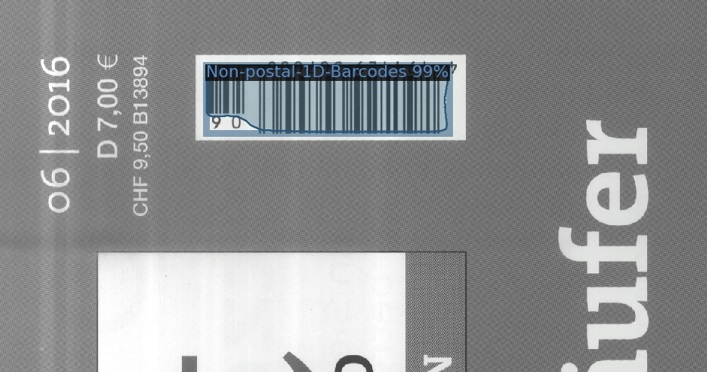

# Barcode Detector Training Using Detectron2

This repository contains code for training a barcode detector using the Detectron2 library. The project is based on the ZVZ dataset, available at: [ZVZ Dataset](https://github.com/abbyy/barcode_detection_benchmark).

## Contents

1. Conversion of the original dataset to the COCO format for object detection.
2. Model training and performance evaluation.

## Installation

To reproduce this process, you will need to install the following libraries:

- PyTorch
- Detectron2
- FiftyOne
- OpenCV (cv2)

Please refer to the official documentation of each library for installation instructions.

## Dataset Conversion

The code for converting the original dataset into the COCO format is located in `convert_dataset.py`. The **FiftyOne** package is used for conversion. After successful conversion, the dataset can be used for training the model.

## Model Training

The model training is conducted with the `train_model.py` script. After training completes, the model will be saved to `output/model_final.pth`. Final performance metrics are computed on the test dataset, allowing for an assessment of the detector's accuracy.

### Evaluation Results on the Test Set

The evaluation results on the test set, as captured during training, are as follows:

**Bounding Box Evaluation:**

|   AP   |  AP50  |  AP75  |  APs   |  APm   |  APl   |
|:------:|:------:|:------:|:------:|:------:|:------:|
| 83.531 | 95.655 | 94.687 | 30.297 | 68.927 | 84.941 |

**Per-Category Bounding Box AP:**

| category   | AP     | category           | AP     | category               | AP     |
|:-----------|:-------|:-------------------|:-------|:-----------------------|:-------|
| Aztec      | 78.307 | DataMatrix         | 86.216 | Non-postal-1D-Barcodes | 83.514 |
| PDF417     | 86.488 | Postal-1D-Barcodes | 83.587 | QRCode                 | 83.075 |

**Segmentation Evaluation:**

|   AP   |  AP50  |  AP75  |  APs   |  APm   |  APl   |
|:------:|:------:|:------:|:------:|:------:|:------:|
| 86.083 | 95.655 | 94.904 | 25.248 | 65.659 | 87.409 |

**Per-Category Segmentation AP:**

| category   | AP     | category           | AP     | category               | AP     |
|:-----------|:-------|:-------------------|:-------|:-----------------------|:-------|
| Aztec      | 80.210 | DataMatrix         | 88.326 | Non-postal-1D-Barcodes | 84.843 |
| PDF417     | 90.120 | Postal-1D-Barcodes | 83.864 | QRCode                 | 89.134 |

## Results

Examples of the trained model's predictions, taken from test images, are saved in the `temp` folder. Below are a few examples:

1. 
2. 
3. 
4. 

If you have any questions or suggestions, please create an issue in this repository.
